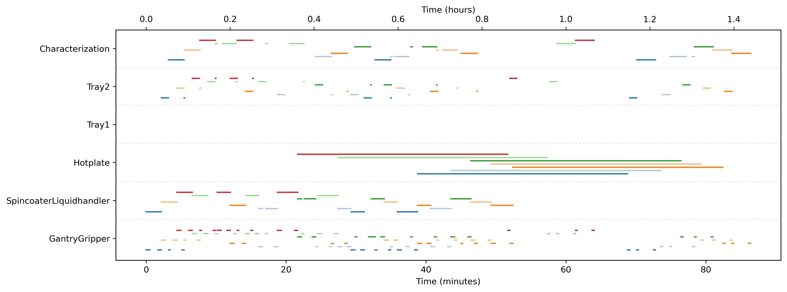

<!-- 

    </img>

 -->
---

# About Me

Depending on who you ask, I'm the "coding guy", the "stats guy", or the "robot guy" These days I am building [self-driving laboratories](https://newscenter.lbl.gov/2023/04/17/meet-the-autonomous-lab-of-the-future/) that autonomously plan experiments, execute them with robots, then analyze the results in a closed loop. My robots have found new materials for solar cells and batteries!

A big believer in open source, I maintain code that supports automated labs across the country. These projects include [graph databases for experimental data](https://www.github.com/rekumar/labgraph), [job scheduling](https://www.github.com/rekumar/roboflo) for collaborative robots, and graph optimizers to [plan volume transfers for complex liquid handling routines](https://www.github.com/rekumar/mixsol).

I'm actively seeking Data Scientist roles to apply my expertise and passion for data science, engineering, and leadership. Let's build together!

---

# Some of my Projects
## Job Scheduling for Robotic Laboratories 

_Python, linear programming with Google OR-Tools_ 

Robots are all the rage in materials science these days, as they can work around the clock with the high precision needed for science experiments. However, many systems are not used at their full capacity -- they do one thing at a time, which is like waiting for your chicken to cook before you chop your vegetables. Roboflo is a scheduling program that uses linear optimization to schedule jobs across a bunch of different robots/tools, allowing us to use our robots to their maximum potential! 

  

In the schedule above, each row corresponds to an individual hardware "actor" within the robotic lab. The bars within the plot represent when each actor is being used, and each color represents a different sample being passed from one actor to the next. Below is a gif of the robots following the schedule above.

  

---

[Quantifying How Water Damages Solar Cells](./solar_cell_humidity.md)
_Python, data visualization, data analysis, experiments_

