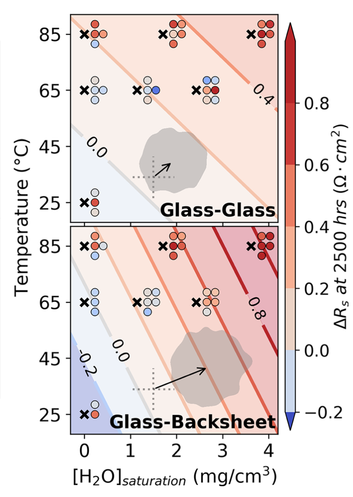

    </img>

---

# About Me

Depending on who you ask, I'm the "coding guy", the "stats guy", or the "robot guy". My background in research, hardware, software, and AI/ML enables me to deploy data-driven solutions in dynamic R&D settings. These days I am building AI-guided [self-driving laboratories](https://newscenter.lbl.gov/2023/04/17/meet-the-autonomous-lab-of-the-future/) that autonomously plan experiments, execute them with robots, then analyze the results in a closed loop to create new materials for solar cells and batteries!

With ten years of industrial and academic research experience, I've honed my ability to quickly grasp complex domain-specific problems and effectively implement the right tools for the task at hand. Sometimes this is building a dashboard to share results with our collaborators, others it is using active learning to drive a >$2b microscope at Argonne National Lab. My work has earned >$1m in business and >$10m in government funding. At the core of my success are curiosity, statistical modeling, and an engineering mindset.

A big believer in open source, I maintain code that supports automated labs across the country. These projects include [graph databases for experimental data](https://www.github.com/rekumar/labgraph), [job scheduling](https://www.github.com/rekumar/roboflo) for collaborative robots, and graph optimizers to [plan volume transfers for complex liquid handling routines](https://www.github.com/rekumar/mixsol).

I'm actively seeking Data Scientist roles to apply my expertise and passion for data science, engineering, and leadership. Let's build the future together!

---

# Some of my Projects
## Job Scheduling for Robotic Laboratories 

_Python, linear programming with Google OR-Tools_ 

Robots are all the rage in materials science these days, as they can work around the clock with the high precision needed for science experiments. However, many systems are not used at their full capacity -- they do one thing at a time, which is like waiting for your chicken to cook before you chop your vegetables. Roboflo is a scheduling program that uses linear optimization to schedule jobs across a bunch of different robots/tools, allowing us to use our robots to their maximum potential! 

## Dissecting the Ways that Water Damages Solar Cells
_Python, data visualization, data analysis, experiments_

Solar cells present a pretty unique engineering challenge -- we need to make a high-performance electronic device that can survive on a roof for decades. Roofs themselves get replaced every 20-30 years, and they just have to keep the rain out! Water gets into solar cells too, and can cause a few problems. We set out to quantify these issues.

We put state-of-the-art solar cells in chambers that simulate the weather, then measured how the cells degrade over time. We took weekly "pictures" of each cell using cameras that show us the water content and electronic performance of these solar cells. We found two types of issues: cells cracking, and increasing electrical resistance. I used image processing (scikit-image) to align these ~4000 images and identify the formation of cracks. The figure below shows a heatmap of where cracks formed, divided by the cell's packaging type (i.e. whether it's protected by glass or a polymeric backsheet).

<!--  -->

I then segmented out the _uncracked_ regions of the cells and tracked how their performance evolved over time. We found that certain types of cells gain resistance faster than others (bad), and that this is correlated with the amount of water that gets into the cell! Furthermore, I fit a response surface model (Python statsmodels) to the data to quantify the relationship of water and temperature to the rate of resistance increase. Below you can see the response surface for each type of cell. The results for individual cells are shown with the scatter points, and the 95% confidence interval of the gradient of the response surface is shaded in the inset plots. We got these two-dimensional confidence intervals by bootstrap sampling within the variance of the parameters of our response surface model. While both types of cells were influenced by water content, only one result was statistically significant!

<!--  -->

Without this image segmentation approach, the performance loss of cracks would drown out the smaller (but still important) influence of resistance increases. This work was published in the [IEEE Journal of Photovoltaics](/images/ward/Kumar%20et%20al%20-%20Moisture%20in%20Photovoltaics.pdf).

