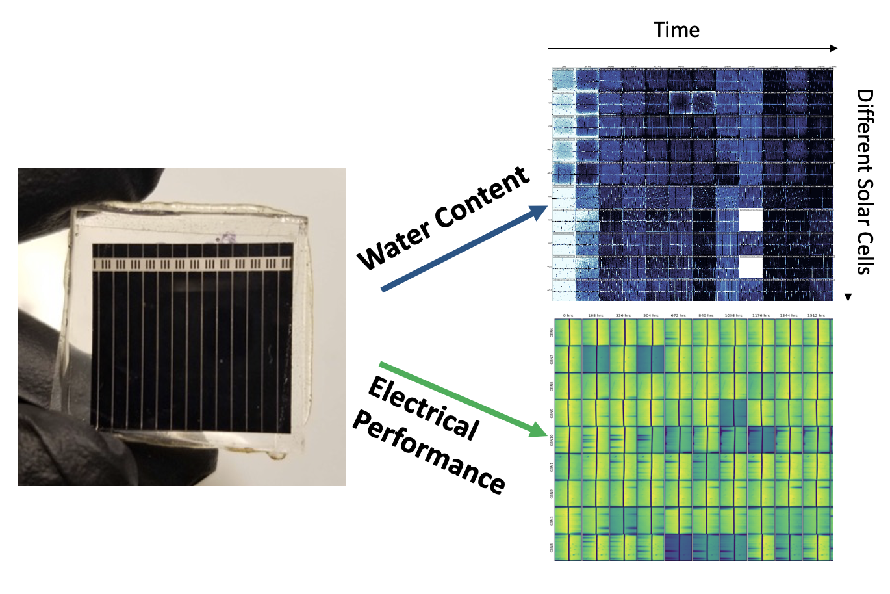
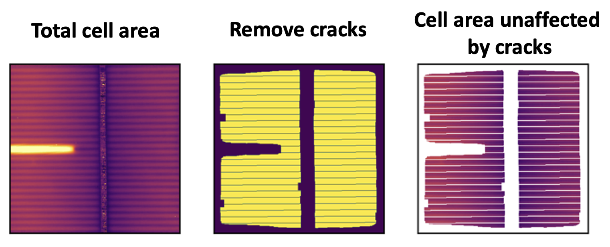

# Quantifying How Water Damages Solar Cells
_Python, data visualization, data analysis, experiments_

This work was published in the [IEEE Journal of Photovoltaics](/images/ward/Kumar%20et%20al%20-%20Moisture%20in%20Photovoltaics.pdf).

Solar cells present a pretty unique engineering challenge -- we need to make a high-performance electronic device that can survive on a roof for decades. Roofs themselves get replaced every 20-30 years, and they just have to keep the rain out! Water gets into solar cells too, and can cause a few problems. We set out to quantify these issues.

We put state-of-the-art solar cells in chambers that simulate the weather, then measured how the cells degrade over time. We took weekly "pictures" of each cell using cameras that show us the water content and electronic performance of these solar cells. You can see some of those pictures below.

We found two issues: cells cracking, and increasing electrical resistance. I used image processing (scikit-image) to align these ~4000 images and identify the formation of cracks. You can see cracks as dark areas in some of the "electrical performance" images above. The figure below shows a heatmap of where cracks formed, stratified by the cell's packaging type (i.e. whether it's protected by glass or a polymeric backsheet).

<!--  -->

I then segmented out the _uncracked_ regions of the cells and tracked how their performance evolved over time. We found that certain types of cells gain resistance faster than others (bad), and that this is correlated with the amount of water that gets into the cell! 

Finally, I fit a response surface model (Python statsmodels) to the resistance changes in the uncracked areas to quantify the influence of water and temperature on the rate of resistance increase. Below you can see the response surface for each type of cell. The results for individual cells are shown with the scatter points, and the 95% confidence interval of the gradient of the response surface is shaded in the inset plots. We got these two-dimensional confidence intervals by bootstrap sampling within the variance of the parameters of our response surface model. While both types of cells were influenced by water content, only one result was statistically significant!

<!--  -->

Without this image segmentation approach, the performance loss from cracks would drown out the smaller (but still relevant) losses of resistance increases. 